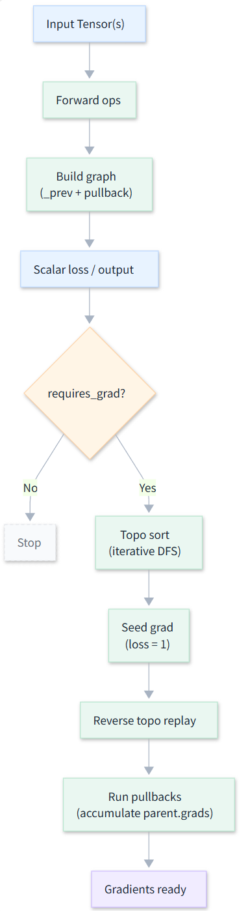
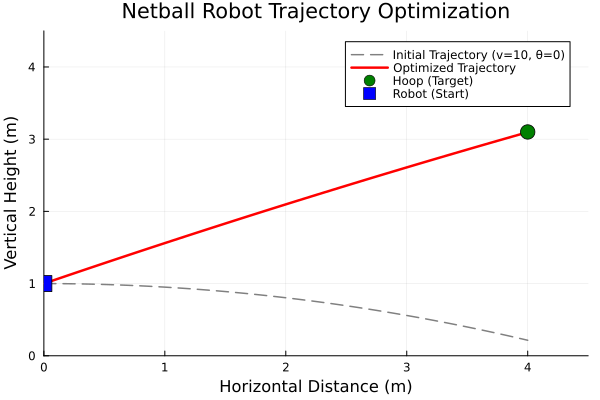
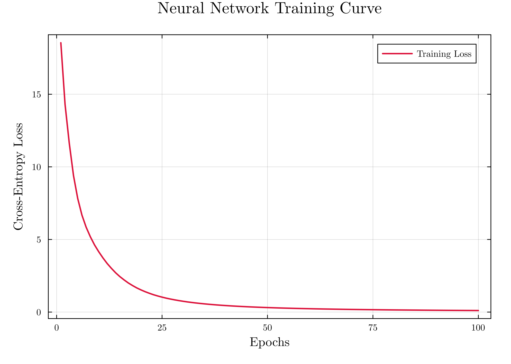
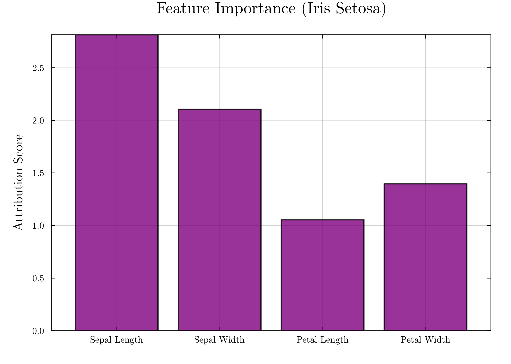

# From Scratch: Reverse-Mode Automatic Differentiation and Integrated Gradients


**EE5311: Differentiable and Probabilistic Computing (CA1 Project)**

**MiniAD** is a lightweight, pedagogical implementation of a Reverse-Mode Automatic Differentiation (AD) engine in Julia. It is built from first principles to demonstrate the "Define-by-Run" paradigm used by modern frameworks like PyTorch, and includes a native implementation of **Integrated Gradients (IG)** for model interpretability.

## 🚀 Key Features

*   **Dynamic Computational Graph**: Builds the graph on-the-fly during forward execution.
*   **Custom Tensor Abstraction**: A `Tensor` struct handling data, gradients, and topological storage.
*   **Broadcast Support**: Seamless differentiation of elementwise operations (e.g., `sin.(x)`, `x .+ y`) via Julia's broadcasting mechanism.
*   **Interpretability**: Built-in, mathematically rigorous implementation of Integrated Gradients (IG) for feature attribution.
*   **Dual Mode IG**: Supports standard AD-based gradients (white-box) and Finite Differences (black-box).

## 🛠️ Architecture

The engine uses a global operator overloading approach combined with an iterative topological sort for stack-safe backpropagation.



## 📦 Repository Structure

*   `MiniAD/`: **The Core Package**. Contains the `MiniAD` module source code.
    *   `src/MiniAD.jl`: Implementation of `Tensor`, backward engine, and operators.
*   `ad_v8.ipynb`: **Main Demo Notebook**. Interactive walkthrough, PyTorch comparisons, and case studies.
*   `EE5311_Julia_CA1_Group6.pdf`: **Full Project Report**. Detailed mathematical formulations and discussion.
*   `main.tex`: LaTeX source for the report.

## 📊 Case Studies

### 1. Physics-Based Optimization (Netball Trajectory)
Optimizing the launch parameters (velocity and angle) of a projectile to hit a target coordinate.

| Trajectory Optimization | Feature Attribution (IG) |
| :---: | :---: |
|  |  |

### 2. Neural Network Interpretability (Iris Classification)
Training a Multi-Layer Perceptron (MLP) from scratch on the Iris dataset and explaining its predictions using Integrated Gradients.

| Training Loss | Feature Importance (Setosa) |
| :---: | :---: |
|  |  |

## 💻 Usage

To explore the project, clone the repo and instantiate the environment:

```julia
# In Julia REPL
using Pkg
Pkg.develop(path="./MiniAD")
using MiniAD

# Define a simple scalar function
x = Tensor(3.0)
y = x * x + 2x
backward(y)
println(x.grad) # Output: 8.0 (2x + 2 at x=3)
```

## 🤝 Team Members

*   **Liu Fei** (A0275104M)
*   **Cao Yuan** (A0275177U)
*   **Jin Xuan** (A0328457U)
*   **Gao Jiaxuan** (A0332428H)
*   **Nan Jinyao** (A0319482X)

---
*Developed for EE5311 at the National University of Singapore.*
